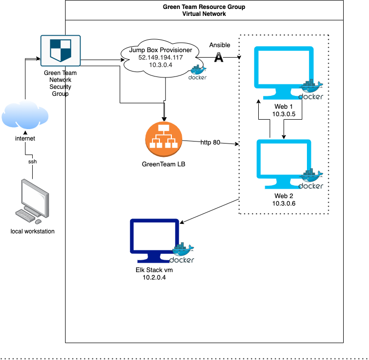
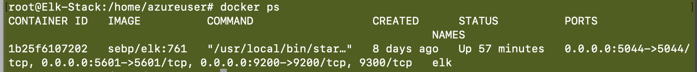

# Elk-Stack-Project
## Automated ELK Stack Deployment

The files in this repository were used to configure the network depicted below.

These files have been tested and used to generate a live ELK deployment on Azure. They can be used to either recreate the entire deployment pictured above. Alternatively, select portions of the ansible files may be used to install only certain pieces of it, such as Filebeat.

  - [File Playbook](roles/file-playbook.yml)

This document contains the following details:
- Description of the Topologu
- Access Policies
- ELK Configuration
  - Beats in Use
  - Machines Being Monitored
- How to Use the Ansible Build

### Description of the Topology

The main purpose of this network is to expose a load-balanced and monitored instance of DVWA, the D*mn Vulnerable Web Application.

Load balancing ensures that the application will be highly reliable, in addition to restricting unwanted traffic to the network.
- What aspect of security do load balancers protect? What is the advantage of a jump box?_  Load balncers help to evenly distribute network traffic.  They aim to protect against Distributed Denial of Service (DDoS) Attacks by shifting attack traffic to a given server.  This strategy improves the performance and availability of applications, websites, databases, and other computing resources. (Source: IBM).  A jump box is a secure computer where users and admins connect to before launching a task or before they connect to other servers or untrusted environments or VM's. It is basically an intermediary host connected through an ssh tunnel to a remote network.

Integrating an ELK server allows users to easily monitor the vulnerable VMs for changes to the _____ and system _____.
- What does Filebeat watch for?  Filebeat is used to forward and centralize log data.  Inputs and harvesters are two componetns that work together to tail files and send event data to a specified output.
- What does Metricbeat record? Metric beat takes statistics and metrics and ships them to a specific output.  Metricbeat helps monitor the system and the services running on the server such as Apache.  Metricbeat connects to Elasticsearch or Logstash and can record the CPU usage, memory, file system, disk io, and network io.

The configuration details of each machine may be found below.
_Note: Use the [Markdown Table Generator](http://www.tablesgenerator.com/markdown_tables) to add/remove values from the table_.

| Name     | Function | IP Address | Operating System |
|----------|----------|------------|------------------|
| Jump Box | Gateway  | 10.0.0.1   | Linux            |
| Web1     | VM       | 10.3.0.5   | Linux            |
| Web2     | VM       | 10.3.0.6   | Linux            |
| Elk Stack| VM       | 10.2.0.4   | Linux            |

### Access Policies

The machines on the internal network are not exposed to the public Internet. 

Only the Jump Box Provisioner machine can accept connections from the Internet. Access to this machine is only allowed from the following IP addresses:
- 73.234.113.193

Machines within the network can only be accessed by the Jump Box or other machines within the network.
- Which machine did you allow to access your ELK VM? What was its IP address? Using a peering link, any vm within the GreenTeamNet Network can access the elk vm.  The subnets for GreenTeamNet are 10.3.0.0/24.

A summary of the access policies in place can be found in the table below.

| Name     | Publicly Accessible | Allowed IP Addresses |
|----------|---------------------|----------------------|
| Jump Box | Yes                 |  73.234.113.193      |
| Web1     | No                  |  10.3.0.0/24 & 73.234.113.193        |
| Web2     | No                  |  10.3.0.0/24 & 73.234.113.193        |
| Elk Stack| No                  |  10.3.0.0/24 & 10.2.0.0/16        |

### Elk Configuration

Ansible was used to automate configuration of the ELK machine. No configuration was performed manually, which is advantageous because automation helps considerably with the representation of Infratructure as Code.  This simplifies creating complex playbooks and makes them easier to reuse.

The playbook implements the following tasks:
- Install docker.io
- Install pip3
- Install Docker python module
- Download and launch Docker Elk container on the published ports

The following screenshot displays the result of running `docker ps` after successfully configuring the ELK instance.

### Target Machines & Beats
This ELK server is configured to monitor the following machines:
- 10.3.0.5 Web1
- 10.3.0.6 Web2

We have installed the following Beats on these machines:
- Filebeat
- Metricbeat

These Beats allow us to collect the following information from each machine:
- _TODO: In 1-2 sentences, explain what kind of data each beat collects, and provide 1 example of what you expect to see. E.g., `Winlogbeat` collects Windows logs, which we use to track user logon events, etc._
- Filebeat tails and ships log data.  You could expect to see [something like this](diagrams/logEx.png) from filebeat.  Metricbeat monitors system services that are running such as Apache.  An other example of metricbeat would be collecting [CPU usage data.](diagrams/metricCPU.png)

### Using the Playbook
In order to use the playbook, you will need to have an Ansible control node already configured. Assuming you have such a control node provisioned: 

SSH into the control node and follow the steps below:
- Copy the _____ file to _____.
- Update the _____ file to include...
- Run the playbook, and navigate to ____ to check that the installation worked as expected.

_TODO: Answer the following questions to fill in the blanks:_
- _Which file is the playbook? Where do you copy it?_
- _Which file do you update to make Ansible run the playbook on a specific machine? How do I specify which machine to install the ELK server on versus which to install Filebeat on?_
- _Which URL do you navigate to in order to check that the ELK server is running?

_As a **Bonus**, provide the specific commands the user will need to run to download the playbook, update the files, etc._
